# 
 Insights for a Strategic Merger in the OTT Domain  

The project topic and questions were taken from a codebasic resume project challenge - https://codebasics.io/challenge/codebasics-resume-project-challenge

Tools used for data analysis were Python, Mysql, Numpy and Pandas. Matplotlib and Seaborn modules for data visualization.

## Domain: Telecom & Streaming Services |  Function: Strategy & Operations 
 
Lio, a leading telecommunications provider in India, is planning a strategic merger with Jotstar, one of the country’s most prominent streaming platforms. This potential partnership aims to combine LioCinema’s expansive subscriber base and Jotstar’s diverse content library to revolutionize digital streaming in India. 

As part of the merger preparation, the management team at Lio wants to analyse the 
performance and user behavior of both platforms—LioCinema and Jotstar—over the past 
one year (January to November 2024). The goal is to gain insights into individual platform performance, content consumption patterns, subscriber growth, Inactivity behavior, upgrade and downgrade trends. The insights derived from this study will help the management make informed decisions and optimize content strategies post-merger, with the ultimate goal of establishing Lio-Jotstar as the leading OTT platform in India.  
 
The management expects detailed insights into the following: 

1. *Content Library Analysis:* A detailed comparison of content types across both platforms.  
2. *Subscriber Insights:* Analyse trends in subscriber acquisition and demographic variations.   
3. *Inactivity Analysis:* Patterns of inactivity across age groups, city tiers, and subscription plans.    
4. *Upgrade Patterns:* Insights into subscription upgrades and their influencing factors.   
5. *Downgrade Patterns:* Analysis of subscription downgrades and associated trends.   
6. *Content Consumption Behavior:* Patterns in total watch time, device preferences, and variations by user demographics.   

# Questions used for detailed Insights

## Total Users & Growth Trends 
  ### What is the total number of users for LioCinema and Jotstar, and how do they compare in terms of growth trends (January–November 2024) ?

  Both platform have unique users.

  Jotstar has around users 44K and Liocinema has 1.83K users. So, overall total user database if both platforms merge = 228066 users.

  Initially Liocinema had 2x more users than Jotstar in Jan'24 but with time it had an exponential growth of 80.44% more users while Jotstar had 19.56% of users till Dec'24.

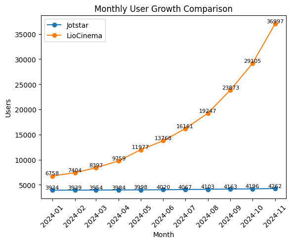
 
## Content Library Comparison 
  
  ### What is the total number of contents available on LioCinema vs. Jotstar? How do they differ in terms of language and content type ?

  #### 📊 Total Content Availability
  - **Jotstar** hosts **2360 titles**, nearly **2x larger** than **LioCinema (1250 titles)**  
  - This indicates a significantly broader content library on Jotstar  

  #### 🎬 Content Type Distribution
  | Content Type | Jotstar | Liocinema |
  |--------------|---------|-----------|
  | Movie        | 1180    | 900       |
  | Series       | 826     | 300       |
  | Sports       | 354     | 50        |

  - Jotstar has a **well-balanced mix** across Movies, Series, and Sports  
  - LioCinema is **heavily skewed towards Movies (~72%)**, with limited Series and Sports content  
  - Jotstar offers **~3x more series** and **~7x more sports content**, indicating stronger engagement variety  

  #### 🌐 Language Distribution
  - Jotstar supports **10 languages**, while LioCinema supports **7 languages**  
  - Jotstar leads in **English (800 vs 56)** and **Hindi (637 vs 424)** content  
  - LioCinema shows **comparable strength in South Indian languages** (Tamil, Telugu, Kannada, Malayalam)  
  - Languages like **Bengali, Gujarati, and Punjabi** are **absent in LioCinema**, reducing its reach in certain regions  

  #### 📌 Key Differences
  - **Jotstar** → Higher content volume, wider language coverage, and diverse content types  
  - **LioCinema** → Smaller library, movie-focused, stronger regional (South Indian) alignment  

  #### ✅ Conclusion
  Jotstar has a clear advantage in **scale, diversity, and platform engagement potential**, while LioCinema follows a **more focused, regional and movie-centric content strategy**.

  **By Language**

  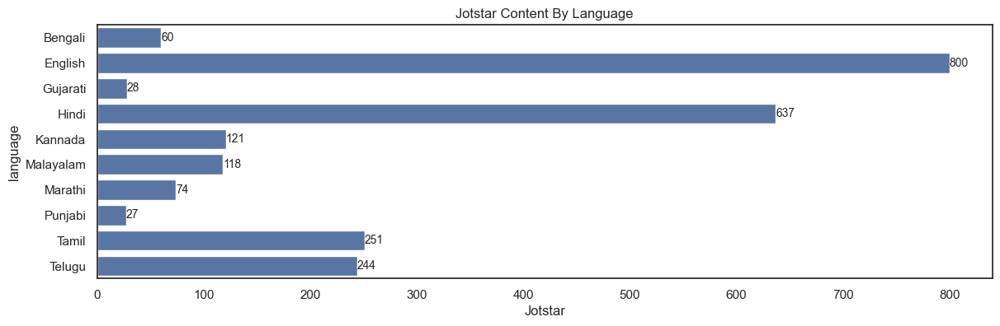
  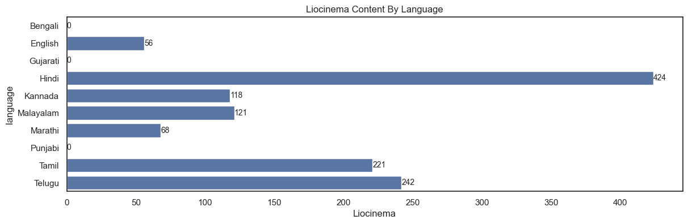

  **By Content Type**

  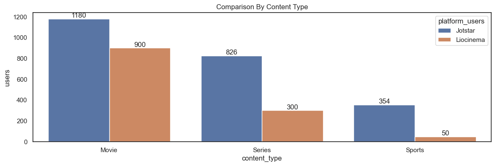
 

## User Demographics 
  ### What is the distribution of users by age group, city tier, and subscription plan for each platform ? 

  **By age group**

  - Liocinema has more young users of age around 18-24 ~79K users while Jotstar has only 7.5K users but has more around 20K users within 5-34 age bracket. 
  - Liocinema have more number of senior users ~19K of age 45+ than Jotstar 5K users.

  **By subscription plans**

  Liocinema has around 1 lakh users with free subscription which is more and Jotstar have 12K users with free subscription. Jotstar shows many users with VIP plan 19k and 13K with Premium plan since it is rich in contents than Liocinema.

  **By city tier**

  On Liocinema platform users mostly comes from Tier3 city ~78K, Tier2 ~63K and ~41K. This tells us that more number of free plan users are coming ffrom tier 2 and tier 3 cities.

  On Jotstar Tier 1 has ~25K users, Tier 2 ~13k users and Tier 3 has ~5K. This tells us that most premium and vip users comes from Tier 1 nad Tier 2.

 #### 
User Demographics of Jotstar Platform

  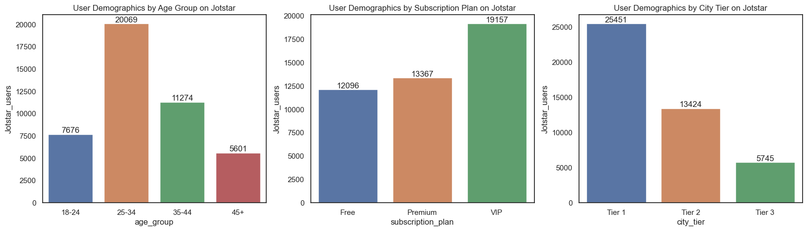

 #### 
User Demographics of Liocinema Platform

  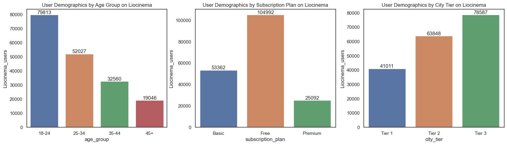

 
## Active vs. Inactive Users 
 ### What percentage of LioCinema and Jotstar users are active vs. inactive? How do these rates vary by age group and subscription plan ?

  Jotstar platform is rich in variety of contents which makes it having 85% of active users mostly coming from age group of 25-34 (16K users) and 35-44 (9k users). These users comes from Tier 1 and Tier 2 cities which makes it obvious that they have more users with VIP and Premium subscription plans.

  There is only 15% of Inactive users on Jotstar which tells us that users prefer watching paid contents. 

  Since Liocinema have more number of users than Jotstar but lacks in content variety. This tells us that liocinema has 55% of active user coming from young audience (18-34, ~40K) and 35-44 age group having ~29K active users. 

  It also has a approx. equal amount of Inactive users (45%). Mostly coming from 18-24, 25-34, 35-44 age groups having ~39K, ~22K, ~13K inactive users respectively. These users have Free and Basic subscription plans ~59K and ~18K respectively. It is understandable that the liocinema lacks diverse content and targeting Tier 3 and Tier 2 cities. 

  **JOTSTAR PLATFORM**

  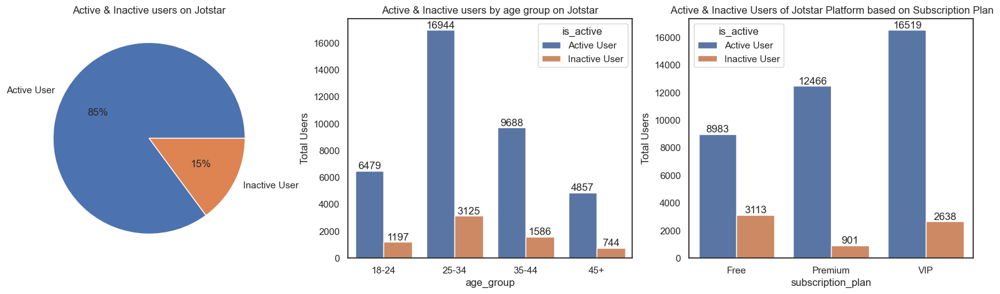

  **LIOCINEMA PLATFORM**
  
  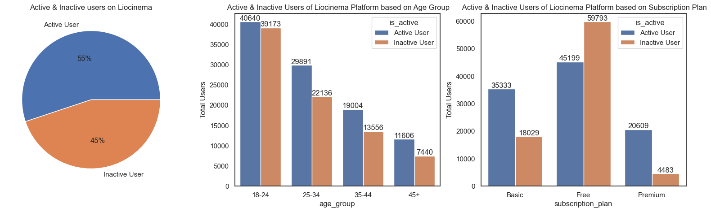

## Watch Time Analysis 
  ### What is the average watch time for LioCinema vs. Jotstar during the analysis period?  How do these compare by city tier and device type ? 
 
  Jotstar has 21,104 mins average watch time as compared to Liocinema with 3609 mins of average watch time.

  Jotstar targets Tier 1 and Tier 2 cities mostly, users in these cities relies on mobile --> TV --> Laptop in that order. 
  Mobile comes out as a most used devices with 10563 mins then TV with 5682 mins and lastly Laptop having 4857 mins of average watch time.

  With 85% less watch time than Jotstar, Liocinema has 2763 mins on Mobile, 759 mins on TV as 495 mins on Laptop of average watch time. 
  
  Both platforms has made most watch time in Tier 1 and Tier 2. With Mobile being the reliable source for entertainment.

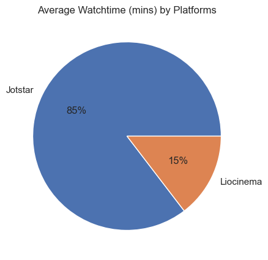

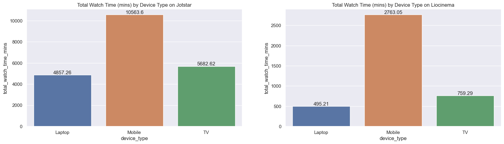

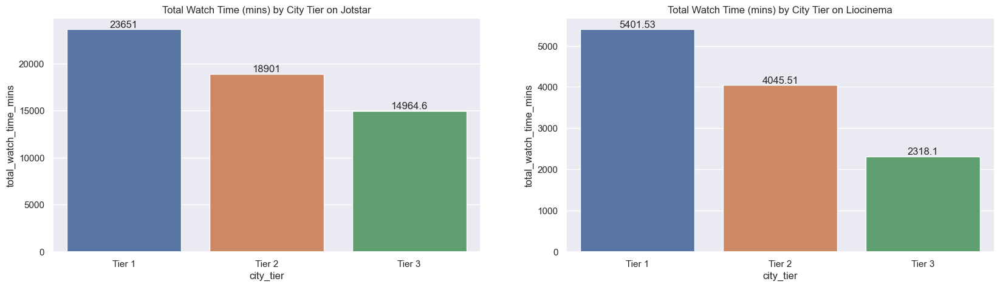

## Inactivity Correlation 
  ### How do inactivity patterns correlate with total watch time or average watch time ? Are less engaged users more likely to become inactive ? 
  A strong relationship is observed between user engagement and inactivity across both platforms.

  Active users consistently exhibit significantly higher average watch time compared to inactive users (3–5x higher).
  Inactive users show persistently low engagement levels throughout the analysis period.
  Additionally, a steady decline in watch time is observed across months, indicating weakening user engagement over time.

  📌 Key Insight:
  Users with lower watch time are far more likely to become inactive, suggesting that declining engagement is a leading indicator of user churn.

  📌 Business Implication:
  Monitoring user watch time can help identify at-risk users early and enable targeted interventions such as personalized recommendations, content notifications, or retention campaigns.

  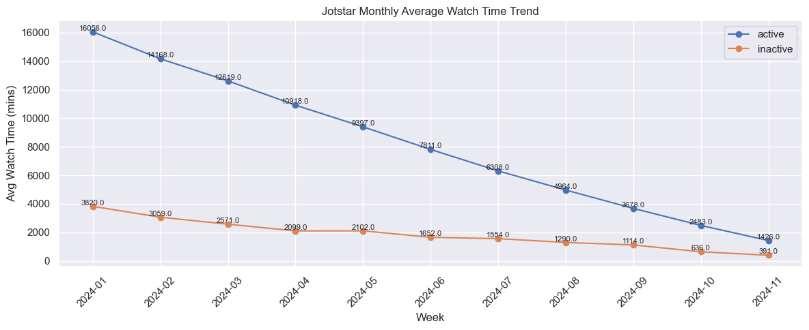

  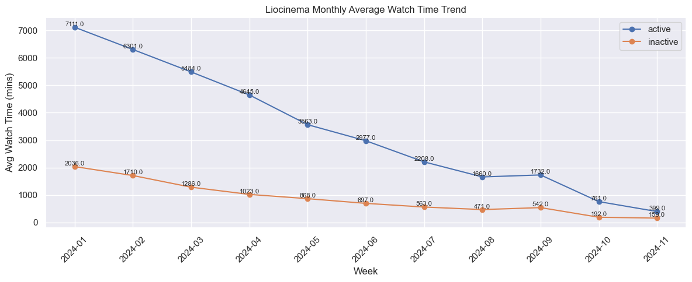
 

## Downgrade Trends 

  ### How do downgrade trends differ between LioCinema and Jotstar? Are downgrades more prevalent on one platform compared to the other ? 
 
  Downgrade rate is 6.15% in Jotstar which is less as compared to Liocinema having 11.37% . The reason for such a low downgrade rate can be a high number contents for users with different languages which is available and more number of users are of VIP, Premium Subcription plan.

  ### Liocinema Platform 

  LioCinema shows a high number of downgrades, primarily from:

  Basic → Free (10,309 users)
  Premium → Free (7,439 users)
  Premium → Basic (3,111 users)

  A significant portion of users are moving all the way down to the Free plan, indicating:

  Users are not finding enough value in paid subscriptions
  Possible price sensitivity, especially among Basic users
  Content or experience may not be strong enough to retain paid users

  👉 Insight: LioCinema faces a high churn risk in paid plans, with many users reverting to free usage.
  

  |subscription_plan | new_subscription_plan | user_id |
  |------------------|-----------------------|---------|
  |	Basic |	Free |	10309 |
  |	Premium |	Basic | 3111 |
  |	Premium | Free | 7439 |

  ### Jotstar Platform 

  Jotstar shows comparatively fewer downgrades:

  VIP → Free (2,149 users) (largest segment)
  Premium → VIP (368 users)
  Premium → Free (225 users)

  Most downgrades are step-down transitions (Premium → VIP), rather than complete drop-offs to Free.

  👉 Insight: Users prefer to stay within paid tiers rather than fully churn. The VIP plan acts as a retention buffer, reducing full downgrades.

| subscription_plan |	new_subscription_plan |	user_id |
|-------------------|-----------------------|---------|
|	Premium |	Free |	225 |
|	Premium |	VIP |	368 |
|	VIP |	Free |	2149 | 

    
  ### Downgrades Stats 

  | Platform	| Downgrades	| Total Users	| Downgrade Rate |
  |-----------|-------------|-------------|----------------|
  |	Jotstar |	2742 | 44620 |6.15 |
  |	Liocinema | 20859 | 183446 | 11.37 | 

  - LioCinema’s downgrade rate is almost 2x higher than Jotstar.
  - Indicates weaker user retention and satisfaction in paid plans.

## Upgrade Patterns 
### What are the most common upgrade transitions (e.g., Free to Basic, Free to VIP, Free to Premium) for LioCinema and Jotstar? How do these differ across platforms ? 
 
  The most common upgrade transition on LioCinema is Free → Basic (2078 users), followed by Basic → Premium (1362 users) and Free → Premium (715 users).

  **🔹 LioCinema**

  The most common upgrade path on LioCinema is Free → Basic (2078 users), followed by Basic → Premium (1362 users) and Free → Premium (715 users).

  This indicates a gradual upgrade behavior, where users prefer entering the paid ecosystem through a lower-priced plan before moving to higher tiers. The relatively smaller number of direct upgrades to Premium suggests:

  High price sensitivity
  Lower initial perceived value of Premium plans

  However, the strong movement from Basic → Premium shows that once users experience paid features, they are more likely to upgrade further.

  👉 Insight: LioCinema relies on a step-by-step conversion funnel, but struggles with direct premium conversions.

  ### Liocinema Platform 
  |subscription_plan | new_subscription_plan | total_users |
  |------------------|-----------------------|---------|
  |	Basic |	Premium |	1362 |
  |	Free | Basic |	2078 |
  |	Free | Premium | 715 |

  **🔹 Jotstar**

  Jotstar shows a different pattern, with the highest upgrades coming from VIP → Premium (2821 users), followed by Free → VIP (844 users) and Free → Premium (683 users).

  This suggests:

  A strong mid-tier (VIP) strategy acting as a bridge to Premium
  Users are more willing to upgrade within the paid ecosystem

  Compared to LioCinema, Jotstar has:

  Higher direct movement into paid tiers
  Stronger Premium conversion from existing paid users

  👉 Insight: Jotstar has a more efficient monetization funnel, especially in converting mid-tier users into Premium subscribers.

  ### Jotstar Platform
  | subscription_plan | new_subscription_plan |total_users |
  |-------------------|-----------------------|--------|
  | Free |Premium | 683 |
  | Free | VIP | 844 |
  | VIP | Premium | 2821 |

  Jotstar’s upgrade rate is ~4x higher than LioCinema. Despite having a smaller user base, Jotstar is significantly better at monetizing users

  ### Upgrade Stats
  | Platform | Upgrades | Total Users | Upgrade Rate |
  |----------|----------|-------------|--------------|
  |	Jotstar | 4348 | 44620 | 9.74 | 
  |	Liocinema | 4155 | 183446 | 2.26 |

  **✅ Key Business Insights**

  Jotstar outperforms LioCinema in user monetization, driven by a strong content library and effective tier structure.
  LioCinema has a large user base but low conversion efficiency, especially from Free to Premium.
  The presence of an intermediate tier (VIP/Basic) plays a crucial role in driving upgrades.

  **🚀 Recommendations**

  - Introduce a stronger value proposition for Premium on LioCinema (exclusive content, early access, ad-free experience).
  - Optimize the mid-tier strategy to better convert users into Premium.
  - Use targeted campaigns to push high-engagement free users toward paid plans.
  - Post-merger, leverage Jotstar’s content strength to improve LioCinema’s upgrade funnel.

## Paid Users Distribution 
  ### How does the paid user percentage (e.g., Basic, Premium for LioCinema; VIP, Premium for Jotstar) vary across different platforms ? Analyse the proportion of premium users in Tier 1, Tier 2, and Tier 3 cities and identify any notable trends or differences. 
 
**Jotstar Paid Users Distribution**

<table border="1" class="dataframe">
  <thead>
    <tr style="text-align: right;">
      <th>subscription_plan</th>
      <th>Premium</th>
      <th>VIP</th>
      <th>Total User</th>
      <th>(VIP + Premium)</th>
      <th>Paid user %</th>
      <th>VIP Plan %</th>
      <th>Premium Plan %</th>
    </tr>
    <tr>
      <th>city_tier</th>
      <th></th>
      <th></th>
      <th></th>
      <th></th>
      <th></th>
      <th></th>
      <th></th>
    </tr>
  </thead>
  <tbody>
    <tr>
      <th>Tier 1</th>
      <td>10178</td>
      <td>10162</td>
      <td>25451</td>
      <td>20340</td>
      <td>79.92</td>
      <td>39.93</td>
      <td>39.99</td>
    </tr>
    <tr>
      <th>Tier 2</th>
      <td>2566</td>
      <td>6794</td>
      <td>13424</td>
      <td>9360</td>
      <td>69.73</td>
      <td>50.61</td>
      <td>19.12</td>
    </tr>
    <tr>
      <th>Tier 3</th>
      <td>623</td>
      <td>2201</td>
      <td>5745</td>
      <td>2824</td>
      <td>49.16</td>
      <td>38.31</td>
      <td>10.84</td>
    </tr>
  </tbody>
</table>

**Liocinema Paid Users Distribution**

<table border="1" class="dataframe">
  <thead>
    <tr style="text-align: right;">
      <th>subscription_plan</th>
      <th>Basic</th>
      <th>Premium</th>
      <th>Total User</th>
      <th>(Basic + Premium)</th>
      <th>Paid user %</th>
      <th>Basic Plan %</th>
      <th>Premium Plan %</th>
    </tr>
    <tr>
      <th>city_tier</th>
      <th></th>
      <th></th>
      <th></th>
      <th></th>
      <th></th>
      <th></th>
      <th></th>
    </tr>
  </thead>
  <tbody>
    <tr>
      <th>Tier 1</th>
      <td>12293</td>
      <td>10306</td>
      <td>41011</td>
      <td>22599</td>
      <td>55.10</td>
      <td>29.97</td>
      <td>25.13</td>
    </tr>
    <tr>
      <th>Tier 2</th>
      <td>22570</td>
      <td>9090</td>
      <td>63848</td>
      <td>31660</td>
      <td>49.59</td>
      <td>35.35</td>
      <td>14.24</td>
    </tr>
    <tr>
      <th>Tier 3</th>
      <td>18499</td>
      <td>5696</td>
      <td>78587</td>
      <td>24195</td>
      <td>30.79</td>
      <td>23.54</td>
      <td>7.25</td>
    </tr>
  </tbody>
</table>

## Revenue Analysis 

### Assume the following monthly subscription prices, calculate the total revenue generated by both platforms (LioCinema and Jotstar) for the analysis period (January to November 2024)

  **✅ Key Business Insights**
  Jotstar significantly outperforms LioCinema in paid user conversion across all city tiers.
  Tier 1 cities are the primary revenue drivers, with high Premium adoption.
  Tier 2 cities show strong potential but require mid-tier optimization.
  Tier 3 cities are volume-heavy but revenue-light, driven by price sensitivity.

  **Jotstar’s advantage:**  
  - Strong content value perception
  - Effective 3-tier pricing strategy (Free → VIP → Premium)

  **LioCinema’s challenge:**  
  - Over-reliance on Basic plans
  - Weak Premium positioning and conversion

  **🚀 Recommendations**
  - Strengthen Premium positioning on LioCinema (exclusive content, ad-free benefits)
  - Introduce a more attractive mid-tier strategy (similar to VIP but with clearer value)
  - Use regional + affordable bundles (especially for Tier 2 & Tier 3 users)
  - Post-merger, leverage Jotstar’s content library to improve paid conversions on LioCinema

  ### Jotstar Paid Users Distribution

| City Tier | Premium | VIP  | Total Users | Paid Users (VIP + Premium) | Paid User % | VIP Plan % | Premium Plan % |
|-----------|---------|------|-------------|----------------------------|-------------|------------|----------------|
| Tier 1    | 10178   | 10162| 25451       | 20340                      | 79.92%      | 39.93%     | 39.99%         |
| Tier 2    | 2566    | 6794 | 13424       | 9360                       | 69.73%      | 50.61%     | 19.12%         |
| Tier 3    | 623     | 2201 | 5745        | 2824                       | 49.16%      | 38.31%     | 10.84%         |

### LioCinema Paid Users Distribution

| City Tier | Basic | Premium | Total Users | Paid Users (Basic + Premium) | Paid User % | Basic Plan % | Premium Plan % |
|-----------|-------|---------|-------------|------------------------------|-------------|--------------|----------------|
| Tier 1    | 12293 | 10306   | 41011       | 22599                        | 55.10%      | 29.97%       | 25.13%         |
| Tier 2    | 22570 | 9090    | 63848       | 31660                        | 49.59%      | 35.35%       | 14.24%         |
| Tier 3    | 18499 | 5696    | 78587       | 24195                        | 30.79%      | 23.54%       | 7.25%          |

**Jotstar Revenue Analysis**

<table border="1" class="dataframe">
  <thead>
    <tr style="text-align: right;">
      <th></th>
      <th>Month Name</th>
      <th>Total Revenue</th>
      <th>revenue distribution percentage</th>
    </tr>
  </thead>
  <tbody>
    <tr>
      <th>9</th>
      <td>November</td>
      <td>7378635.0</td>
      <td>15.5</td>
    </tr>
    <tr>
      <th>10</th>
      <td>October</td>
      <td>6941410.0</td>
      <td>14.5</td>
    </tr>
    <tr>
      <th>11</th>
      <td>September</td>
      <td>6145362.0</td>
      <td>12.9</td>
    </tr>
    <tr>
      <th>1</th>
      <td>August</td>
      <td>5690712.0</td>
      <td>11.9</td>
    </tr>
    <tr>
      <th>5</th>
      <td>July</td>
      <td>4955398.0</td>
      <td>10.4</td>
    </tr>
    <tr>
      <th>6</th>
      <td>June</td>
      <td>4382184.0</td>
      <td>9.2</td>
    </tr>
    <tr>
      <th>8</th>
      <td>May</td>
      <td>3822220.0</td>
      <td>8.0</td>
    </tr>
    <tr>
      <th>0</th>
      <td>April</td>
      <td>3102156.0</td>
      <td>6.5</td>
    </tr>
    <tr>
      <th>7</th>
      <td>March</td>
      <td>2713479.0</td>
      <td>5.7</td>
    </tr>
    <tr>
      <th>3</th>
      <td>February</td>
      <td>1804066.0</td>
      <td>3.8</td>
    </tr>
    <tr>
      <th>4</th>
      <td>January</td>
      <td>744034.0</td>
      <td>1.6</td>
    </tr>
    <tr>
      <th>2</th>
      <td>December</td>
      <td>52068.0</td>
      <td>0.1</td>
    </tr>
  </tbody>
</table>

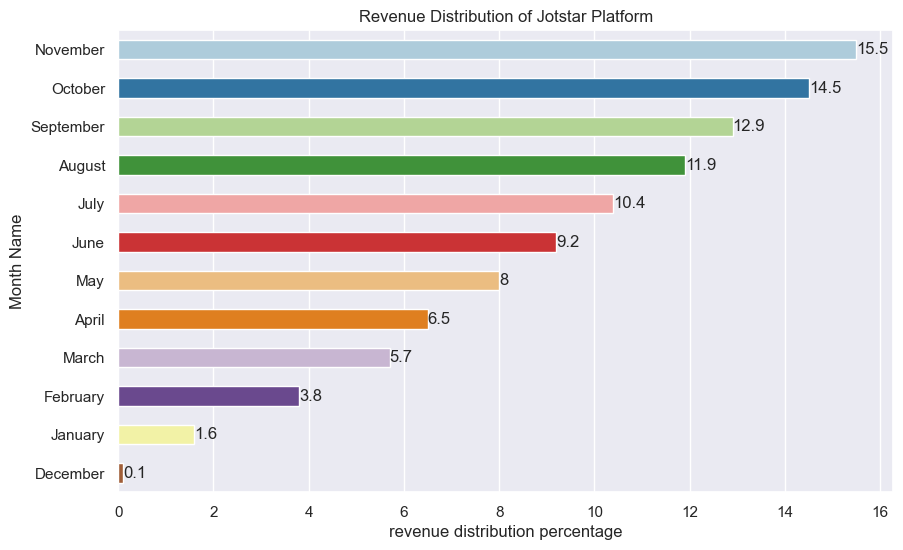

**Liocinema Revenue Analysis**

<table border="1" class="dataframe">
  <thead>
    <tr style="text-align: right;">
      <th></th>
      <th>Month Name</th>
      <th>Total Revenue</th>
      <th>revenue distribution percentage</th>
    </tr>
  </thead>
  <tbody>
    <tr>
      <th>3</th>
      <td>February</td>
      <td>4055232.0</td>
      <td>18.4</td>
    </tr>
    <tr>
      <th>7</th>
      <td>March</td>
      <td>3628449.0</td>
      <td>16.4</td>
    </tr>
    <tr>
      <th>6</th>
      <td>June</td>
      <td>2082330.0</td>
      <td>9.4</td>
    </tr>
    <tr>
      <th>0</th>
      <td>April</td>
      <td>2079612.0</td>
      <td>9.4</td>
    </tr>
    <tr>
      <th>8</th>
      <td>May</td>
      <td>2021850.0</td>
      <td>9.2</td>
    </tr>
    <tr>
      <th>1</th>
      <td>August</td>
      <td>1725576.0</td>
      <td>7.8</td>
    </tr>
    <tr>
      <th>5</th>
      <td>July</td>
      <td>1568742.0</td>
      <td>7.1</td>
    </tr>
    <tr>
      <th>11</th>
      <td>September</td>
      <td>1399869.0</td>
      <td>6.3</td>
    </tr>
    <tr>
      <th>4</th>
      <td>January</td>
      <td>1332276.0</td>
      <td>6.0</td>
    </tr>
    <tr>
      <th>10</th>
      <td>October</td>
      <td>1229460.0</td>
      <td>5.6</td>
    </tr>
    <tr>
      <th>9</th>
      <td>November</td>
      <td>905190.0</td>
      <td>4.1</td>
    </tr>
    <tr>
      <th>2</th>
      <td>December</td>
      <td>36576.0</td>
      <td>0.2</td>
    </tr>
  </tbody>
</table>

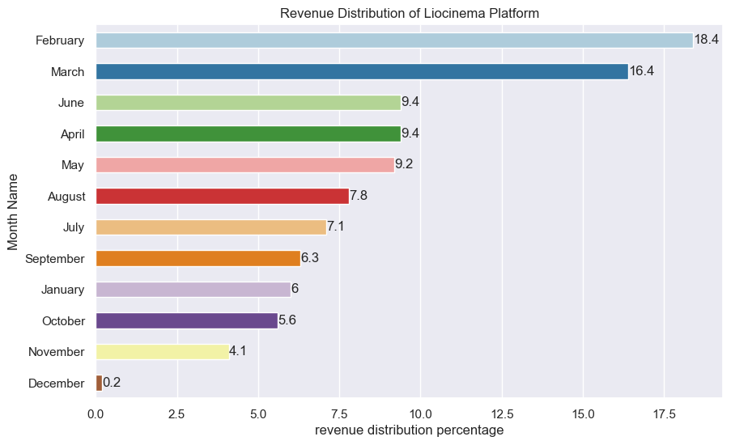

